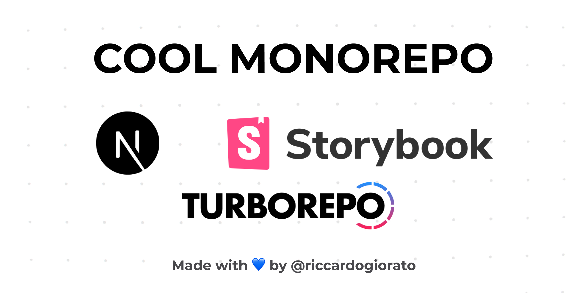

# Cool Monorepo

A monorepo Template with Next.js, Storybook Design System, Turborepo, and much more



**Monorepo Template with:**

1. Storybook as a Design System to showcase and test your Components
2. Next.js to make the best website ever.
3. Turborepo to make everything fast!

- Design System (Storybook.js) deployed on Vercel: https://cool-monorepo-design-system.vercel.app/

- Website deployed on Vercel: https://cool-monorepo-site.vercel.app/

## What's inside?

This Turborepo includes the following packages and apps:

### Apps and Packages

- `site`: A site powered by [Next.js](https://nextjs.org)
- `design-system`: Core React components and Storybook to provide a full design system
- `utils`: shared React utilities
- `tsconfig`: shared `tsconfig.json`s used throughout the monorepo
- `eslint-preset`: ESLint preset

Each package and app is 100% [Typescript](https://www.typescriptlang.org/).

### Utilities

This turborepo has some additional tools already setup for you:

- [Typescript](https://www.typescriptlang.org/) for static type checking
- [ESLint](https://eslint.org/) for code linting
- [Prettier](https://prettier.io) for code formatting

## Using this example

Click on [this Github link](https://github.com/riccardogiorato/cool-monorepo/generate) to start from this template to create your own project!

## Deploying this Monorepo on Vercel

### Design System Config

- Build Command:

```
yarn design-system-vercel
```

- Output Directory: packages/design-system/dist

### Site Config

- Build Command:

```
yarn site-vercel
```

- Output Directory: packages/site/dist
